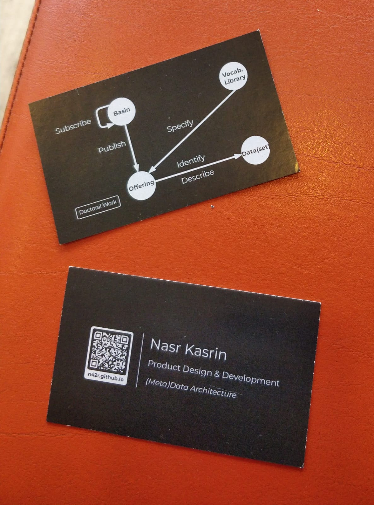
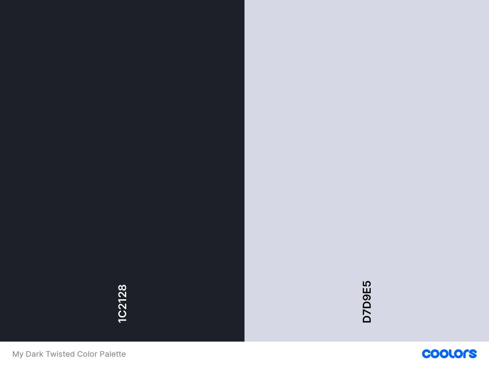

# My Dark Twisted Business Card

With the help of many, I was able to design and print a semi-decent business card (in seven days!). So I feel it's only fair that I publish the sources and the process I followed to achieve this goal to maybe inspire others to make their own dark, twisted business cards. I publish it under the most permissible Creative Commons license, CC-0-1.0. Have fun!

## TLDR; The short way and the long way (pick one)

Want to quickly make your card and do not have experience with GIMP, Photoshop, and similar tools? Or don't want the headache? I made a shortcut. You can use a copy of an **earlier draft** of my card on [canva.com](https://www.canva.com/) which is linked below. You will need to make a free account to create a copy and edit the card on the website as you please.

My Canva.com card can be accessed [here](https://www.canva.com/design/DAFfyUQBQY8/kvZ0tlFibd94JO8TkwvOfw/edit?utm_content=DAFfyUQBQY8&utm_campaign=designshare&utm_medium=link2&utm_source=sharebutton). You need to select "File" and "Make a copy" and if you are signed in, then Voilà!

## Used tools
- [GIMP](https://www.gimp.org/) (free and open-source): main graphics editor. I haven't used it much before, but working with it was a treat! I really didn't feel a difference between it and my memory of using Adobe Photoshop in an odd project 10 years ago (*Not needed if you decide to go the Canva.com route).
- [Draw.io](https://github.com/jgraph/drawio-desktop) (Apache-2.0): I have used many times when preparing my PhD thesis, it is a charm to use, and I never found it limiting. I will talk about my figure generation workflow below (if you need to make figures, else, you can skip it).
- [QR Planet](https://qrplanet.com/) (Generous Freemium): For generating and managing QR codes. Lovely service. Great feature set regarding the aesthetics for generating QR codes, and they give many useful tips on printing and publishing QR codes. As a tip, make an account and create dynamic QR-codes instead of static ones, whose redirection address can be changed at any time, even after the card has been printed!
- [Canva.com](https://www.canva.com/): I initially started using canva.com to design the card, and it went a long way (80% of the way). I ended up aborting this direction because I was in a hurry to print and have the card. They offer templates, an online editing tool, and a coupled printing service. In general, if you don't know or want to learn graphics editing tools like GIMP, and you don't have a local printing shop or service you already know or trust, then using canva.com as an 360 degrees solution, might be a good option. It is also possible to download your designed card in some okay formats, but to get the SVG format (for highest quality) you have to sign up. Finally, I can't vouch for their printing service because I did not try it.

## Color Palette
Regarding the color palette, I think it is no secret that I was aiming for a dark mode effect. I took inspiration from github's dark mode, which is neat. But I added a touch of red to both colors and explored that space until something worked. Basically, I felt the original colors for the card would be too 'sharp,' for lack of a better word, so I explored adding some red into them and this is what I ended up in.

## Type

I have several typefaces that I fancy, and [Montserrat](https://en.wikipedia.org/wiki/Montserrat_(typeface) is one of them. Started in 2010, it is released under the SIL Open Font License, so it is freely available. It is also the type used on my personal webpage that is reachable via the QR-code scanning, although I don't think anyone would realize that.

## Figure Workflow (SVG is your friend)

I design the figures in draw.io, and then export them as SVG (File > Export As > SVG) and in the dialog box I select transparent background and in the "Text Settings" option I select "Embed Fonts" from the drop down menu (because I also use Montserrat in draw.io for the figures as well and want the font to display properly once its rendered by the host application). 

In GIMP I drag and drop the figure into the main business card document and in the renderer prompt I set the *Resolution* as 300 pixels/in and select the target width and height. I also used SVG as the format to download the finished QR code from QR Planet, and then loaded it into GIMP in the same way.

## QR codes
Generating, using, managing, and publishing QR codes is not a straightforward as it seems. It is easy to just generate some QR code, but there are so many dimensions that need to be tweaked and modified. There is so much to say here and I am not an expert. So I will just leave you with two insightful articles that I used myself by QR Planet: [this](https://qrplanet.com/help/article/how-to-print-qr-code) and [this](https://qrplanet.com/9-tips-how-to-use-qr-codes). 

P.S.: You can make some wild QR designs if you want, just make sure that they are easily scannable / detectable by smart phone cameras.

## The structure of the main business card document

There are two layer groups: *Front Card* and *Back Cadr* (typo), and each has contents that are hierarchically structured, to the best of my rookies graphic design abilities! So, it should be easy to go a head and remove the elements and add your own.

I include both an XCF file (GIMP native) and a PSD file (for Photoshop heads), which I generated in GIMP using the "Export To" option.
