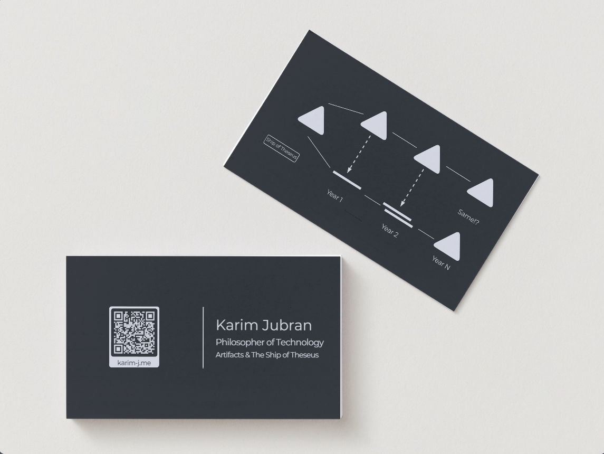
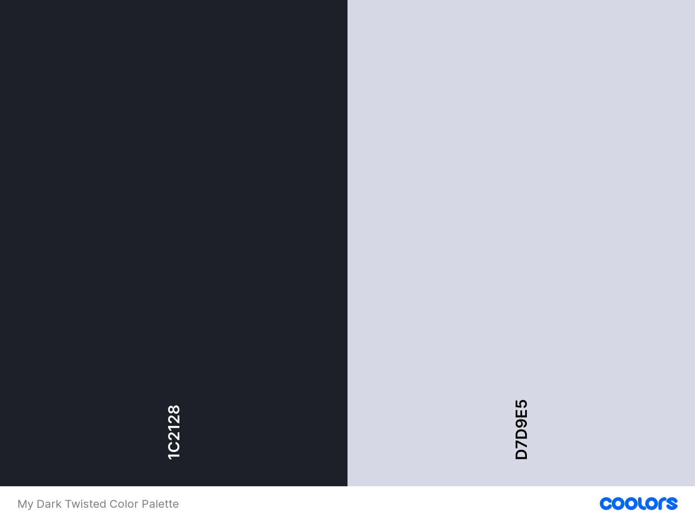

# My Dark Twisted Business Card

With the help of many souls, I was able to design and print a semi-decent business card. So I feel it's only fair that I publish the sources and the process I followed to inspire others to make their own *dark twisted business cards*. I publish it under the most permissible Creative Commons license, CC-0-1.0, so you can do practically whatever you like with it!

I describe **two** ways you can make your own business card, and I provide the source files I developed for my business card so you don't need to start from scratch. You are welcome to use the template as it is without having to modify the design whatsoever! 

- The first way (the short way), requires almost no new software or skills and happens using an online tool (free registration required) and an online hosted version of the `dark twisted business card` (see figure below), so you can start to have results in 10-30 minutes.
 
- The second way (the hacker way), describes how to do it using graphics editors (I use GIMP which is reliable and free, some people are used to Photoshop).

Have fun!

## The short way

If you don't have experience with graphics editors or don't want the headache, you can use a copy of an **earlier draft** of my card on [canva.com](https://www.canva.com/) which is linked below. You will need to make a free account to create a copy and edit the card on the website as you please. They offer many other templates, an easy to use online card editing tool, and a coupled printing service. Although I did not end up using canva.com myself  (damn hipster!; also, see below), I think it's a decent route.

**Note**: The only issue you need to note about using canva.com is that you will *probably* need to use their printing service. This is not a bad thing, just something to keep in mind if you plan to print elsewhere (the source files of the card will stay on the website).

The `dark twisted business card` template on canva.com card can be accessed [here](https://www.canva.com/design/DAFfyUQBQY8/bho4BS_G2sAMXSsDsE2_Fg/view?utm_content=DAFfyUQBQY8&utm_campaign=designshare&utm_medium=link&utm_source=publishsharelink&mode=preview).

## Used tools
- [GIMP](https://www.gimp.org/) (free and open-source): main graphics editor. I haven't used it much before, but working with it was a treat! I really didn't feel a difference between it and my memory of using Adobe Photoshop in an odd project 10 years ago (*Not needed if you decide to go the Canva.com route).
- [Draw.io](https://github.com/jgraph/drawio-desktop) (Free to use): I have used many times when preparing my PhD thesis, it is a charm to use, and I never found it limiting. I will talk about my figure generation workflow below (if you need to make figures, else, you can skip it).
- [QR Planet](https://qrplanet.com/) (Generous Freemium): For generating and managing QR codes. Lovely service. Great feature set regarding the aesthetics for generating QR codes, and they give many useful tips on printing and publishing QR codes. As a tip, make an account and create dynamic QR-codes instead of static ones, whose redirection address can be changed at any time, even after the card has been printed!
- [Canva.com](https://www.canva.com/): I initially started using canva.com to design the card, and it went a long way (80% of the way). I ended up aborting this direction because I was in a hurry to print and I needed the source files to print the card with a local shop. In general, if you don't know or want to learn graphics editing tools like GIMP, and you don't have a local printing shop or service you already know or trust, then using canva.com as an 360 degrees solution, might be a good option. I can't vouch for their printing service because I did not try it, but the quality control of their services that I tried has been generally high, so it should be okay.

## Color Palette
Regarding the color palette, I think it's no secret that I was aiming for a dark mode effect. I took inspiration from github's dark mode. I added a touch of red to both colors and explored that space until something worked. Basically, I felt the original colors for the card would be too 'sharp and cold,' so I explored adding some red into them until I got a hint of what I was looking for.

## Typeface: Montserrat

I have several typefaces that I fancy and [Montserrat](https://en.wikipedia.org/wiki/Montserrat_(typeface)) is one of them. Started in 2010 in Buenos Aires, Argentina, it is released under the SIL Open Font License, so it is freely available. It even has a nice [backstory](https://en.wikipedia.org/wiki/Montserrat_(typeface)#Background_and_development).

If you go the long way or want to make your own figures that include text, you will need to install Montserrat. You can get it from google fonts [here](https://fonts.google.com/specimen/Montserrat). Click on "Download Family" on the top right corner, and then extract the zip file and double click on the file `Montserrat-VariableFont_wght.ttf` and select "Install" on the top left corner (Windows). Then you will need to restart your editors to detect the new typeface.

## Figure Workflow

I designed the figures in draw.io, and then exported them as SVG (File > Export As > SVG) and in the dialog box I select "Transparent Background" and in the "Text Settings" option I select "Embed Fonts" from the drop down menu (because I also use Montserrat in draw.io for the figures and want the font to display properly once it's rendered by the host application). 

In GIMP I drag and drop the figure into the main business card document and in the renderer prompt I set the *Resolution* to 300 pixels/in and select the target width and height. I also used SVG as the format to download the finished QR code from QR Planet, and then loaded it into GIMP in the same way. 

**Canva.com route**: If you went the canva.com route, it might not accept adding SVGs, in that case you need to render them into high resolution PNG using some application on your computer and then load that into canva.com. You can use GIMP to do that, same as the process I discussed in the previous paragraph, and then "Export As" PNG. OR, just generate PNGs from the beggining, although you have to be careful you will be going from vector to raster graphics, so quality (sharpness) might degrade. One way to minimize that is by making the PNGs larger and then scaling them down in Canva.com. That seems to keep things sharp (don't be afraid to go overboard with the resolution of PNGs!).

## QR codes
Generating, using, managing, and publishing QR codes is not a straightforward as it seems. It is easy to just generate some QR code, but there are so many dimensions that need to be tweaked and modified. There is so much to say here and I am not an expert. So I will just leave you with two insightful articles that I used myself by QR Planet: [this](https://qrplanet.com/help/article/how-to-print-qr-code) and [this](https://qrplanet.com/9-tips-how-to-use-qr-codes). 

P.S.: You can make some wild QR designs if you want, just make sure that they are easily scannable / detectable by smart phone cameras.

## For those going the hacker way

For those who want to use a graphics editing software, I include a GIMP native file (*dark-twisted-card.xcf*) and a Photoshop file (*dark-twisted-card.psd*) which I generated in GIMP using the "Export To" option.

There are two layer groups in these files: *Front Card* and *Back Cadr* (typo), and each has contents that are hierarchically structured. So, it should be easy to go ahead and remove or edit elements and add your own.

